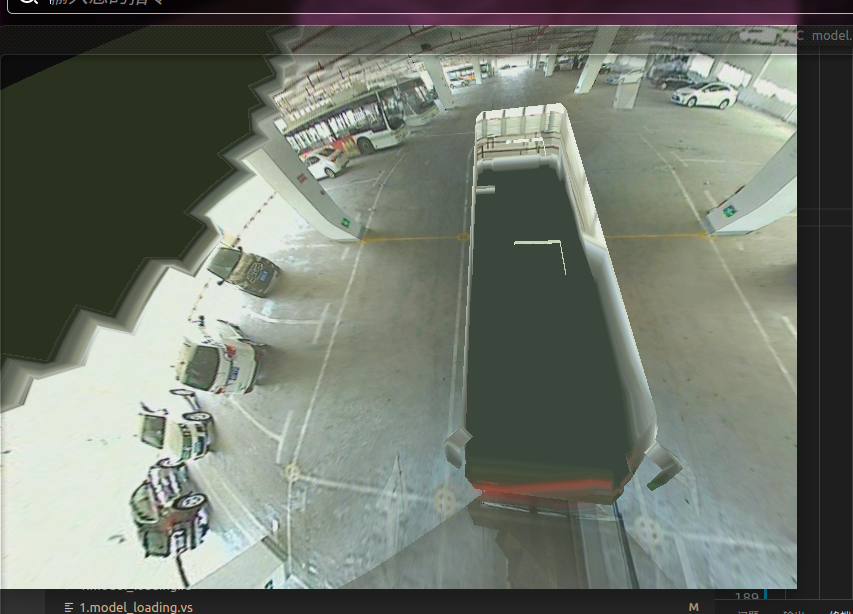
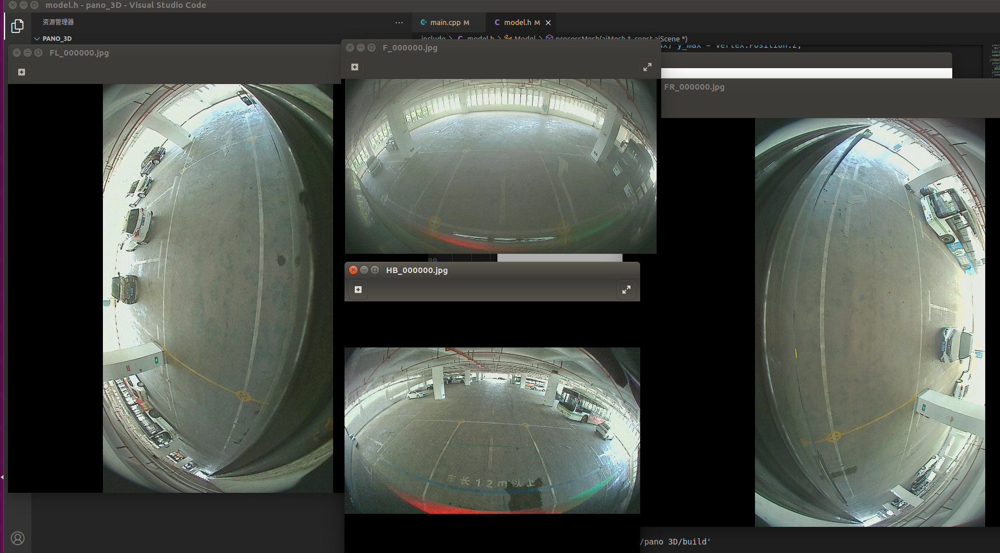

安装opengl环境

**GLFW 3.3.1安装**

​              

```
  sudo apt-get install libglfw3-dev
```

​              

**GLM数学库 安装**

​               

```
 sudo apt install libglm-dev //根据具体情况需要安装的依赖 sudo apt-get install build-essential sudo apt-get install libgl1-mesa-dev sudo apt-get install libglu1-mesa-dev sudo apt-get install freeglut3-dev         
```

​     

**GLAD 安装**

打开网页 https://glad.dav1d.de/， 根据自己opengl版本配置。

​                //查看配置方法一 DISPLAY=:0 glxgears -info | grep GL_VERSION //查看配置方法二 glxinfo | grep -i opengl //输出结果 $ GL_VERSION    = 4.6.0 NVIDIA 415.27              

故配置如下，点击右下角的GENERATE按钮，然后在弹出的界面点击glad.zip进行下载：

​    

下载下来后，右键点击glad.zip选择提取到此处即可解压。

​                cd glad/include sudo mv glad/ /usr/local/include #将glad目录移动到/usr/local/include sudo mv KHR/ /usr/local/include #将KHR目录移动到/usr/local/include              

最后将glad/src目录下的glad.c文件拷贝一份到你的工程源码目录下，如跟main.cpp文件在同一个目录下。


apt安装cuda

apt安装glog gflags

sudo apt-get install libassimp-dev


上午：





