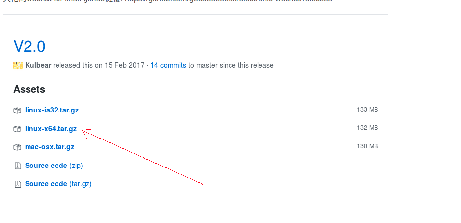

1.安装包

大佬的wechat for linux github链接: https://github.com/geeeeeeeeek/electronic-wechat/releases

 

2.配置可运行desktop快捷启动(桌面图标快捷启动)

wangyetao@linux_u1604:~$ cat /usr/share/applications/wechat.desktop 
[Desktop Entry]
Version = 2.0
Name = wechat
GenericName =wechat
Comment = wechat
Exec = /opt/electronic-wechat-linux-x64/electronic-wechat
Icon = /opt/electronic-wechat-linux-x64/resources/wechat_logo.png
Terminal = false
Type = Application
Categories = GNOME;Application;Network;
wangyetao@linux_u1604:~$ 

安装后:

https://www.youtube.com/watch?v=9Ng8PB2f66g&ab_channel=%E5%8B%81%E8%81%B2%E6%B1%BD%E8%BB%8A%E9%9F%B3%E9%9F%BF.%E5%BD%B1%E9%9F%B3%E7%A7%91%E6%8A%80
