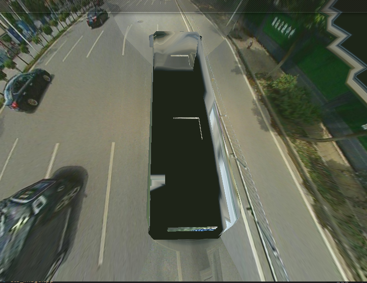
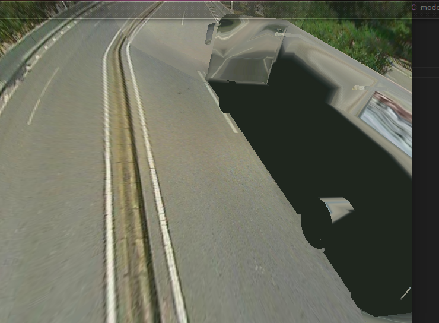
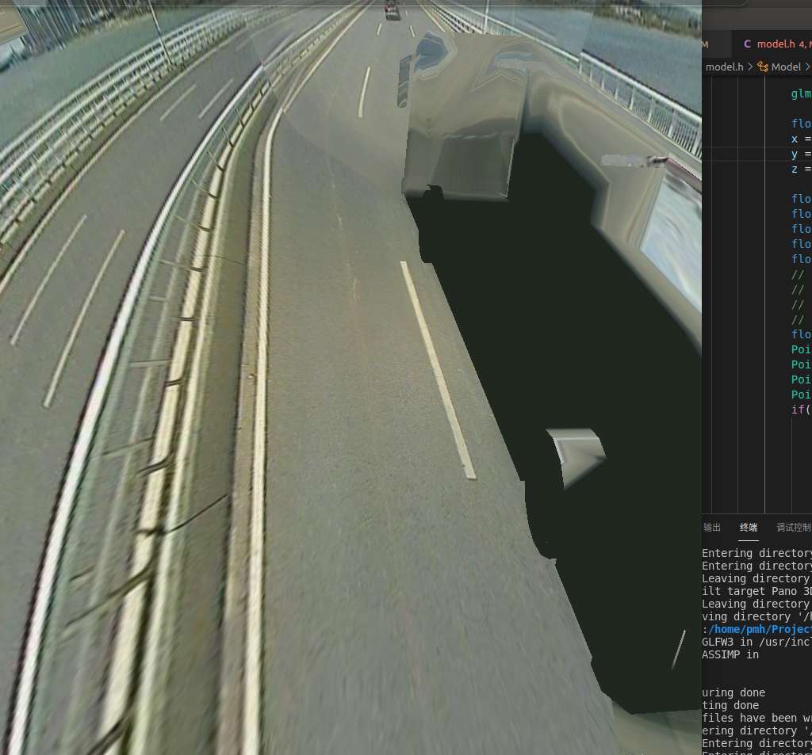
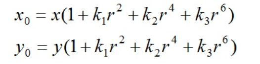

双视图几何学理论

https://blog.csdn.net/m0_43609475/article/details/112832897

### 畸变产生的原因：

#### 径向畸变

定义：由透镜的形状引起的畸变称为径向畸变。即沿着透镜半径方向分布的畸变，产生原因是光线在远离透镜中心的地方比靠近中心的地方更加弯曲，这种畸变在普通廉价的镜头中表现更加明显

### 径向畸变的数学模型

## 切向畸变

定义：切向畸变是由于透镜本身与相机传感器平面（成像平面）或图像平面不平行而产生的，这种情况多是由于透镜被粘贴到镜头模组上的安装偏差导致

### Opencv实现张正友法相机标定

相机标定的目的：获取摄像机的内参和外参矩阵（同时也会得到每一幅标定图像的选择和平移矩阵），内参和外参系数可以对之后相机拍摄的图像就进行矫正，得到畸变相对很小的图像。

相机标定的输入：标定图像上所有内角点的图像坐标，标定板图像上所有内角点的空间三维坐标（一般情况下假定图像位于Z=0平面上）。

相机标定的输出：摄像机的内参、外参系数。

详情参见

https://blog.csdn.net/weixin_42653918/article/details/89294957#t1

# harris算子

