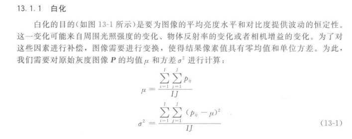
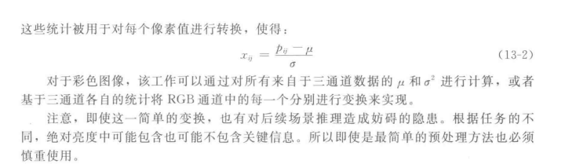
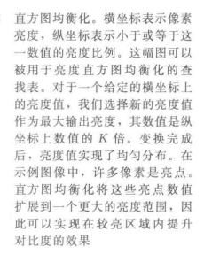
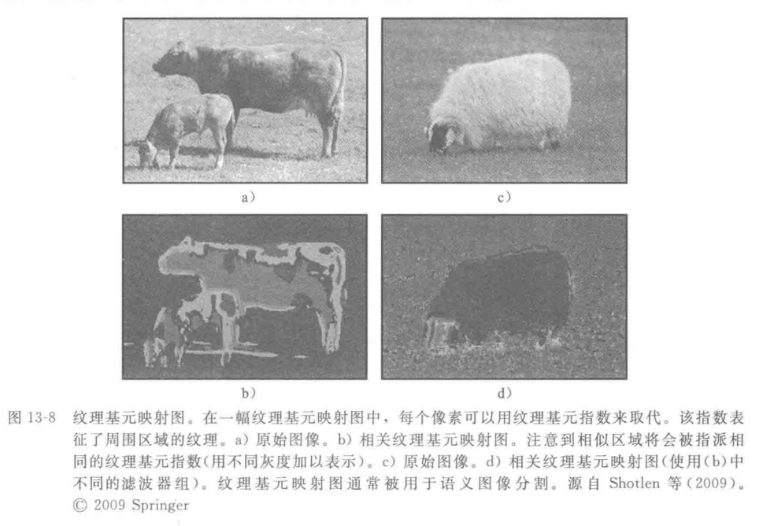

### 角点及角点检测

角点是图像的一种重要局部特征，它决定了图像中目标的形状，所以在图像匹配、
目标描述与识别以及运动估计、目标跟踪等领域，角点提取具有十分重要的意义。在计
算机视觉和图像处理中，对于角点的定义有着不同的表述，其具体定义和描述主要有如
下几种： 
①角点是一阶导数的局部最大值所对应的像素点； 
②角点是指两条以上的边缘的交点； 
③角点指示了物体边缘变化不连续的方向； 
④角点处的一阶导数最大，而且高阶导数为零； 
⑤角点处不仅梯度的数值大，而且梯度方向的变化率也很大。也就是说，角点指示
了图像在二维空间内灰度变化剧烈的位置，是和周围的邻点有着明显差异的像素点。

第一类定义不能准确地定位角点，当检测到边缘时其一阶导数均局部最大，虽然能
较好的区分边缘和灰度平滑区域，但没有考虑角点处的曲率，故不能区分边缘与角点；
第二类定义不够准确，不易于数学表达，定义太抽象；第三类考虑到了角点处曲率的变
化与边缘处的不同，为更准确的角点定义奠定了基础；第四类定义不够准确，不能很好
的区分角点、边缘、平滑区域，不易于数学描述；第五类定义既考虑了梯度的局部最大
(角点也是边缘点的一部分)，又考虑了梯度方向的变化率(只有当梯度方向剧烈变化时才
指示为角点)。
从上述描述可知第五类定义利用灰度信息，计算曲率和梯度能很好的区分角点、边缘与平滑区域，且易于数学表达。由于在实际工作中不需要提取边缘，因此得到了广泛的应用。

MAP  ：最大后验概率

### 图像预处理：

xiawu

### 边缘、角点和兴趣点

仿射变换(affine transform)与透视变换

cvWrapAffine(src,dst,mat)

cvWrapPerspective

\1) 用途
将2D矩阵图像变换成3D的空间显示效果，全景拼接．

\2) 方法
透视变换是将图片投影到一个新的视平面，也称作投影映射．它是二维（x,y）到三维(X,Y,Z)，再到另一个二维(x’,y’)空间的映射．
相对于仿射变换，它提供了更大的灵活性，将一个四边形区域映射到另一个四边形区域（不一定是平行四边形）．它不止是线性变换．但也是通过矩阵乘法实现的，使用的是一个3x3的矩阵，矩阵的前两行与仿射矩阵相同(m11,m12,m13,m21,m22,m23)，也实现了线性变换和平移，第三行用于实现透视变换．

10.20日报

上午：学习仿射变换和投影变换原理代码

下午：继续生成模型，将低畸变模型底部拉长

