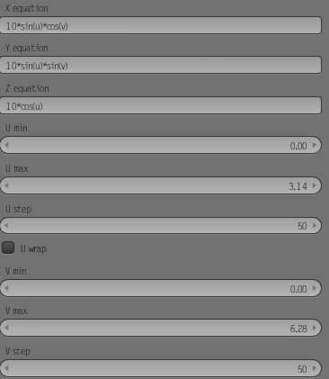
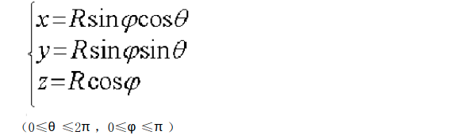
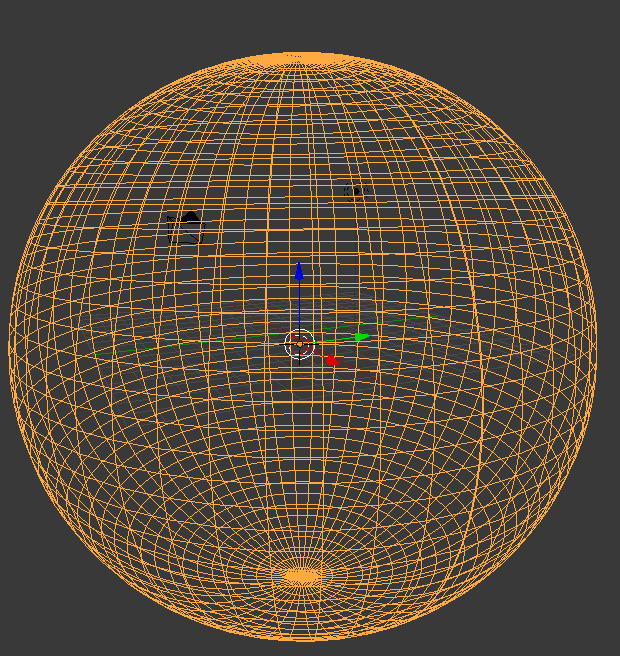

1.脚本的制作

```python
mport bpy

from random import randint

bpy.ops.mesh.primitive_cube_add()

#创建模型的数量

count = 100

for c in range(0,count):

    x = randint(-100,100)

    y = randint(-100,100)

    z = randint(-100,100)

    bpy.ops.mesh.primitive_cube_add(location=(x,y,z))
    
    
    
# bpy.ops.mesh.primitive_xyz_function_surface()

#底部
 bpy.ops.mesh.primitive_xyz_function_surface(x_eq="0.5*v*cos(2*3.14/100*u)", y_eq="10", z_eq="-0.5*v*sin(2*3.14/100*u)", range_u_min=0, range_u_max=100, range_u_step=100, wrap_u=False, range_v_min=0, range_v_max=19, range_v_step=20, wrap_v=False, close_v=True, n_eq=1, a_eq="0", b_eq="0", c_eq="0", f_eq="0", g_eq="0", h_eq="0")
 
 
    n2=n1*c*pai/(4a)=
    
#连接
bpy.ops.mesh.primitive_xyz_function_surface(x_eq="0.5*v*cos(2*3.14/100*u)", y_eq="10", z_eq="-0.5*v*sin(2*3.14/100*u)", range_u_min=0, range_u_max=100, range_u_step=100, wrap_u=False, range_v_min=0, range_v_max=27, range_v_step=20, wrap_v=False, close_v=True, n_eq=1, a_eq="0", b_eq="0", c_eq="0", f_eq="0", g_eq="0", h_eq="0")
bpy.ops.mesh.primitive_xyz_function_surface(x_eq="(10+15*sin(3.14*v/(4*23)))*cos(u*2*3.14/100)", y_eq="10+15-15*cos(3.14/(4*23)*v)", z_eq="-(10+15*sin(3.14*v/(4*23)))*sin(u*2*3.14/100)", range_u_min=0, range_u_max=100, range_u_step=100, wrap_u=False, range_v_min=0, range_v_max=23, range_v_step=20, wrap_v=False, close_v=False, n_eq=1, a_eq="0", b_eq="0", c_eq="0", f_eq="0", g_eq="0", h_eq="0")


```

1.建立各个平面

shift+A -》 math function -》xyzfunction

2.调整到同一坐标轴上

3.桥接组合


xyzfunciton用法：



如图所示是一个球体的参数方程



u step  v step 为 划分的线条数（越大线条越密集）




