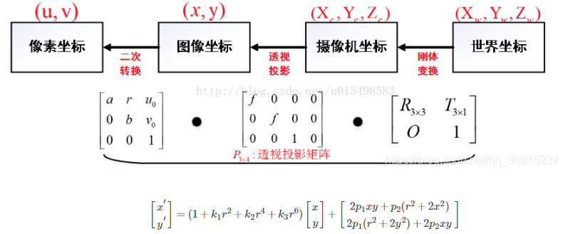

夜望星空你会感觉到天上所有的星星似乎都在同一球面上，分不清远近，这就是视差位移为零造成的结果。

先通过calibrate Camera（）得到畸变系数

生成矫正后的图像

void initUndistortRectifyMap(

 InputArray 

cameraMatrix,  相机内参

InputArray distCoeffs,                     

InputArray R, 

InputArray newCameraMatrix,

Size size,

 int m1type, 

OutputArray map1, 

OutputArray map2 );

